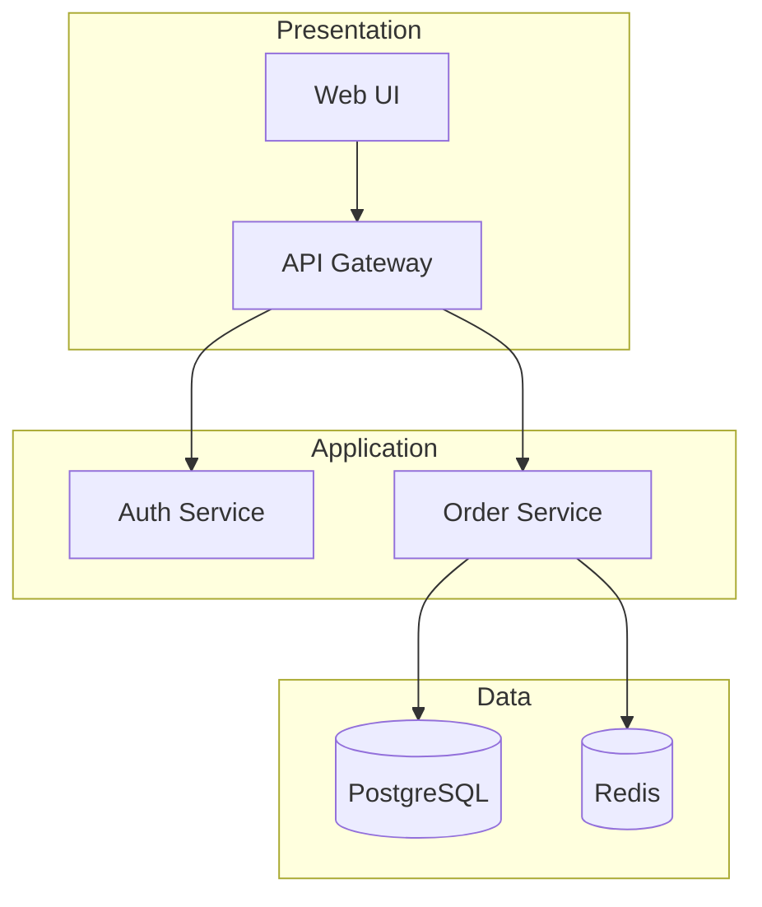

# Architecture Patterns

Reference for architectural design and documentation. Use this skill when:
- Architect reviews system design
- Planner considers architectural constraints
- Analyst investigates integration approaches
- Critic evaluates architectural alignment

## Architecture Decision Records (ADR)

### ADR Format

Every significant architectural decision should be documented:

```markdown
# ADR-[NNN]: [Decision Title]

## Status
[Proposed | Accepted | Deprecated | Superseded by ADR-XXX]

## Context
[What is the situation? What forces are at play?]

## Decision
[What is the change being proposed or decided?]

## Consequences
### Positive
- [Benefit 1]
- [Benefit 2]

### Negative
- [Tradeoff 1]
- [Tradeoff 2]

### Neutral
- [Side effect]

## Alternatives Considered
1. [Alternative 1]: [Why rejected]
2. [Alternative 2]: [Why rejected]

## Related
- ADR-XXX: [Related decision]
- [External reference]
```

### When to Write ADRs

| Scenario | ADR Required? |
|----------|--------------|
| New external dependency | Yes |
| New architectural pattern | Yes |
| Technology switch | Yes |
| Module boundary change | Yes |
| Performance tradeoff | Yes |
| Bug fix | No |
| Refactoring (same behavior) | Usually no |

---

## Common Patterns

### Layered Architecture

```
┌─────────────────────────────────┐
│         Presentation            │  UI, API endpoints
├─────────────────────────────────┤
│          Application            │  Use cases, orchestration
├─────────────────────────────────┤
│           Domain                │  Business logic, entities
├─────────────────────────────────┤
│        Infrastructure           │  DB, external services
└─────────────────────────────────┘
```

**Rules:**
- Dependencies point downward only
- Lower layers never import from higher
- Domain has no external dependencies

**Use when:** Enterprise apps, clear separation needed

### Repository Pattern

**Purpose:** Abstract data access, enable testability

```typescript
// Interface in domain layer
interface UserRepository {
  findById(id: string): Promise<User | null>;
  save(user: User): Promise<void>;
}

// Implementation in infrastructure layer
class PostgresUserRepository implements UserRepository {
  async findById(id: string): Promise<User | null> {
    const row = await db.query('SELECT * FROM users WHERE id = $1', [id]);
    return row ? mapToUser(row) : null;
  }
}
```

**Use when:** 
- Need to swap data stores
- Testing without real database
- Multiple data sources

### Service Layer

**Purpose:** Encapsulate business operations

```typescript
class OrderService {
  constructor(
    private orderRepo: OrderRepository,
    private paymentGateway: PaymentGateway,
    private notifier: Notifier
  ) {}

  async placeOrder(cart: Cart, payment: PaymentInfo): Promise<Order> {
    const order = Order.fromCart(cart);
    await this.paymentGateway.charge(payment, order.total);
    await this.orderRepo.save(order);
    await this.notifier.sendConfirmation(order);
    return order;
  }
}
```

**Use when:**
- Multiple steps in operation
- Transaction coordination
- Cross-cutting concerns

### Event-Driven Architecture

```
┌─────────┐    Event    ┌─────────┐
│ Service │───────────► │  Queue  │
│    A    │             │         │
└─────────┘             └────┬────┘
                             │
              ┌──────────────┼──────────────┐
              ▼              ▼              ▼
         ┌─────────┐   ┌─────────┐   ┌─────────┐
         │ Handler │   │ Handler │   │ Handler │
         │    1    │   │    2    │   │    3    │
         └─────────┘   └─────────┘   └─────────┘
```

**Use when:**
- Loose coupling between components
- Asynchronous processing
- Multiple consumers of same event
- Audit trail needed

### Dependency Injection

**Purpose:** Invert control, enable testing

```typescript
// Without DI (hard to test)
class OrderService {
  private db = new PostgresDatabase();
}

// With DI (testable)
class OrderService {
  constructor(private db: Database) {}
}

// Production
new OrderService(new PostgresDatabase());

// Test
new OrderService(new MockDatabase());
```

---

## Anti-Patterns to Detect

| Anti-Pattern | Detection | Fix |
|--------------|-----------|-----|
| **God Object** | Class with 20+ methods, 500+ lines | Extract classes |
| **Circular Dependencies** | A→B→C→A | Introduce interface |
| **Big Ball of Mud** | No clear structure | Define boundaries |
| **Spaghetti Code** | Tangled control flow | Refactor, add layers |
| **Golden Hammer** | Same pattern everywhere | Choose appropriate |
| **Anemic Domain** | Data classes + procedure classes | Move logic to domain |
| **Leaky Abstraction** | Implementation details exposed | Hide behind interface |
| **Premature Optimization** | Complex code for speed | Measure first |

### Detection Commands

```bash
# Find large files (potential God objects)
find . -name "*.ts" -exec wc -l {} \; | sort -rn | head -10

# Find circular dependencies (TypeScript)
npx madge --circular src/

# Find files with many imports
grep -c "^import" src/**/*.ts | sort -t: -k2 -rn | head -10
```

---

## System Architecture Documentation

### Required Sections

For `system-architecture.md`:

1. **Purpose**: What does this system do?
2. **High-Level Architecture**: Diagram, major components
3. **Components**: Each component's responsibility
4. **Data Flow**: How data moves through system
5. **Dependencies**: External services, libraries
6. **Quality Attributes**: Performance, security, scalability goals
7. **Decisions**: ADRs or decision log
8. **Known Issues**: Technical debt, problem areas

### Diagram Standards

Use Mermaid for version-controlled diagrams:



---

## Agent Responsibilities

### Architect Agent
- Maintain `system-architecture.md` as single source of truth
- Document ADRs within master doc
- Challenge plans violating architectural constraints
- Provide verdicts: APPROVED / APPROVED_WITH_CHANGES / REJECTED

### Analyst Agent
- Reference architecture when investigating integration points
- Consult Architect for systemic pattern questions
- Document architectural context in analysis findings

### Planner Agent
- Read `system-architecture.md` before planning
- Ensure plans respect documented patterns
- Flag architectural impact in plan scope

### Critic Agent
- Reference `system-architecture.md` during plan review
- Verify architectural alignment
- Flag plans that violate documented decisions

See [references/diagram-templates.md](references/diagram-templates.md) for diagram examples.
